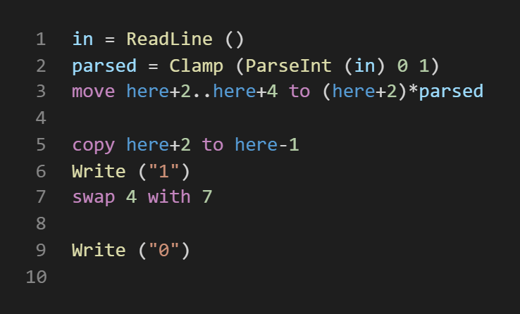
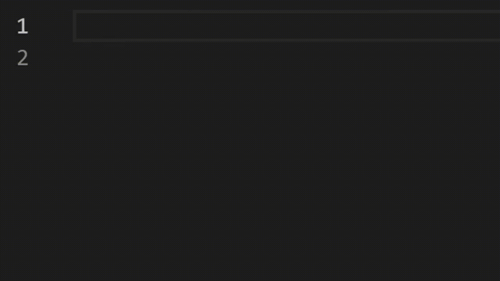

# Reline Language Basics

This extension provides support for syntax highlighting and snippets for the [Reline esolang](https://www.github.com/thinker227/RelineLang). It does however not (yet) provide support for semantic analysis.

## Features

Rich syntax highlighting for `.rl` files.

Convenience snippets for common code.

## Known Issues

* Strings cannot span multiple lines but the syntax highlighting allows this.

## Release Notes

### 1.0.0

Initial release.
